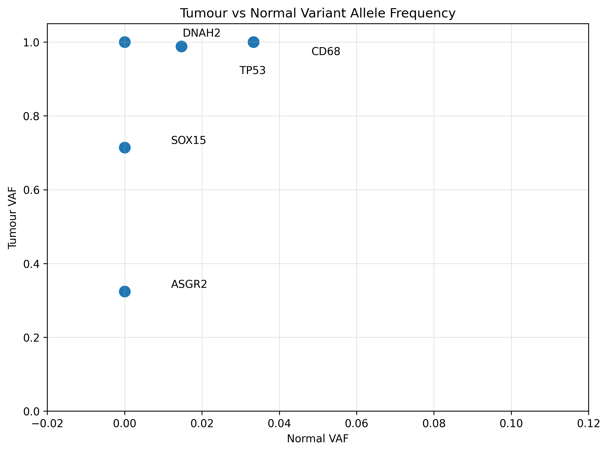
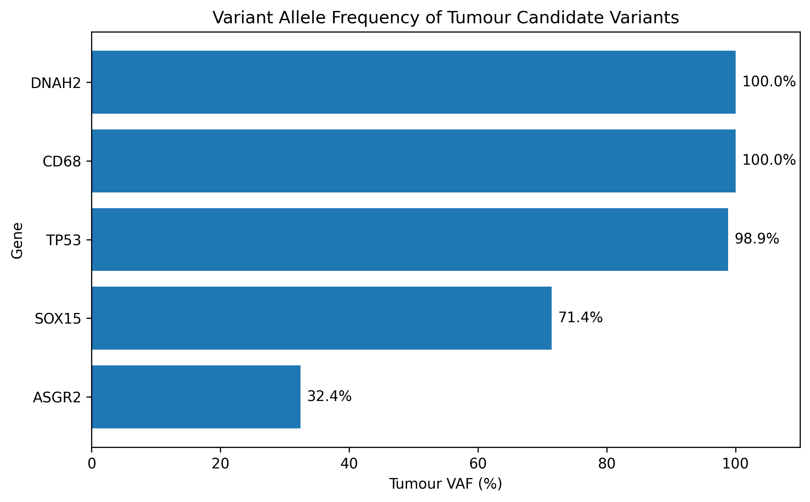
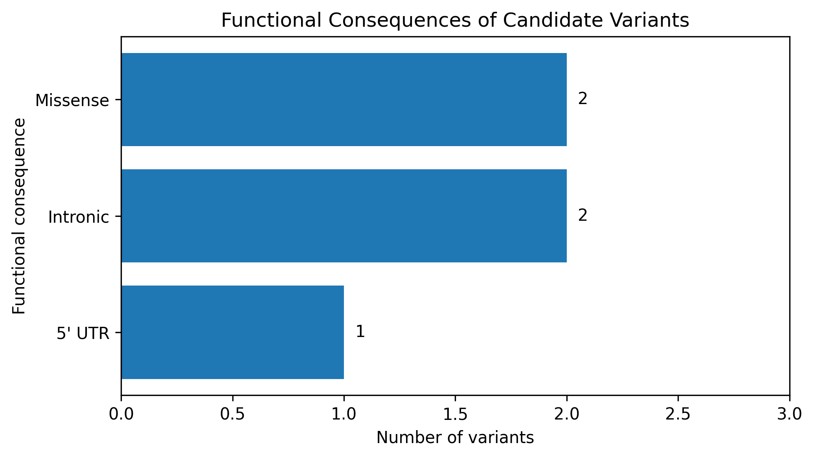

# NGS Cancer Biomarkers — Tumour/Normal Variant Analysis

## Overview

This project implements a reproducible bioinformatics workflow for the analysis of paired tumour/normal NGS data.

The workflow performs variant calling on a subset of chromosome 17, filters tumour-enriched candidate variants, annotates them with Ensembl VEP, and explores the resulting variants using Python.

The analysis uses paired sequencing data from:

- **HCC1395** — breast cancer cell line
- **HCC1395BL** — matched normal control

The objective is to identify and characterize candidate genomic variants enriched in the tumour sample.

---

## Workflow

```text
Tumour BAM + Normal BAM
          |
          v
     BAM validation
       SAMtools
          |
          v
   Variant calling
      BCFtools
          |
          v
    736 raw variants
          |
          v
 Tumour/Normal filtering
          |
          v
 5 candidate variants
          |
          v
    Ensembl VEP
          |
          v
 Functional annotation
          |
          v
 Python analysis
 Pandas + Matplotlib
          |
          v
 Biological interpretation
```

---

## Dataset

The analysis uses paired tumour/normal exome sequencing data restricted to:

```text
Chromosome 17
GRCh37
17:7,000,000-8,000,000
```

Input files:

```text
data/raw/HCC1395_normal.bam
data/raw/HCC1395_tumour.bam
```

Reference genome:

```text
data/reference/GRCh37_chr17.fa
```

Raw sequencing data and the reference genome are excluded from the repository because of their size.

---

## Tools

### Bioinformatics

- SAMtools
- BCFtools
- Ensembl VEP REST API

### Python

- Python
- pandas
- matplotlib
- Jupyter Notebook

### Environment

The command-line workflow was developed using Ubuntu through WSL on Windows.

---

## Variant Calling

Variants are jointly called from the normal and tumour BAM files using:

```text
bcftools mpileup
        |
        v
bcftools call
```

The initial analysis identified:

```text
736 raw variant records
```

---

## Candidate Variant Filtering

Candidate variants were selected using the following exploratory criteria:

```text
Normal genotype = 0/0
Tumour contains an alternative allele
QUAL >= 30
Tumour depth >= 10
Tumour ALT reads >= 3
Tumour VAF >= 10%
Normal VAF <= 5%
```

These thresholds are used for educational and exploratory analysis and are not intended for clinical variant interpretation.

After filtering:

```text
736 raw variants
        |
        v
5 tumour-enriched candidate variants
```

---

## Candidate Variants

| Position | REF | ALT | Gene | Consequence | Normal VAF | Tumour VAF | Protein change |
|---|---|---|---|---|---:|---:|---|
| 17:7011019 | C | G | ASGR2 | Intronic | 0.0% | 32.4% | — |
| 17:7482930 | T | G | CD68 | 5' UTR | 3.3% | 100.0% | — |
| 17:7491818 | G | C | SOX15 | Missense | 0.0% | 71.4% | p.Gln194Glu |
| 17:7578406 | C | T | TP53 | Missense | 1.5% | 98.9% | p.Arg175His |
| 17:7710987 | C | G | DNAH2 | Intronic | 0.0% | 100.0% | — |

---

## Key Result

One of the most notable candidates identified by the workflow is:

```text
Chromosome: 17
Position:   7578406
REF:        C
ALT:        T

Gene:       TP53
Consequence: missense_variant

Coding change:
c.524G>A

Protein change:
p.Arg175His
R175H
```

The genomic substitution appears as `C>T`, whereas the TP53 transcript annotation is `G>A` because TP53 is located on the reverse strand.

This result demonstrates the ability of the workflow to progress from aligned sequencing reads to an interpretable protein-level variant.

---

## Functional Consequences

Among the five candidate variants:

```text
Missense variants : 2
Intronic variants : 2
5' UTR variants   : 1
```

The two protein-altering variants are:

```text
SOX15  p.Gln194Glu
TP53   p.Arg175His
```

---

## Visualizations

### Tumour vs Normal Variant Allele Frequency

This figure compares the variant allele frequency in the paired normal and tumour samples.



Candidate variants show low allele frequencies in the normal sample and substantially higher allele frequencies in the tumour sample.

---

### Tumour VAF by Gene



This visualization shows the proportion of tumour sequencing reads supporting each candidate alternative allele.

---

### Functional Consequences



The candidate variants include coding, intronic, and regulatory-region variants.

---

## Repository Structure

```text
ngs-cancer-biomarkers/
│
├── data/
│   ├── raw/
│   ├── reference/
│   └── sample_names.txt
│
├── figures/
│   ├── tumour_vaf_by_gene.png
│   ├── vaf_normal_vs_tumour.png
│   └── variant_consequences.png
│
├── notebooks/
│   └── variant_analysis.ipynb
│
├── results/
│   ├── annotation/
│   │   ├── annotated_candidates.tsv
│   │   └── final_candidate_summary.tsv
│   │
│   └── variants/
│       ├── raw_variants.vcf.gz
│       ├── raw_variants_renamed.vcf.gz
│       ├── tumour_candidates.tsv
│       ├── tumour_candidates.vcf.gz
│       └── variants_table.tsv
│
├── scripts/
│   ├── run_variant_pipeline.sh
│   └── annotate_vep.py
│
├── .gitignore
├── requirements.txt
└── README.md
```

---

## Reproducing the Analysis

### 1. Install command-line tools

On Ubuntu:

```bash
sudo apt update
sudo apt install samtools bcftools -y
```

Check the installation:

```bash
samtools --version
bcftools --version
```

### 2. Install Python dependencies

```bash
pip install -r requirements.txt
```

### 3. Prepare the input data

Place the paired BAM files in:

```text
data/raw/
```

using the following names:

```text
HCC1395_normal.bam
HCC1395_tumour.bam
```

Place the GRCh37 chromosome 17 FASTA file in:

```text
data/reference/GRCh37_chr17.fa
```

### 4. Run the variant pipeline

```bash
bash scripts/run_variant_pipeline.sh
```

Expected result:

```text
Raw variants:       736
Candidate variants: 5
```

### 5. Annotate variants

```bash
python3 scripts/annotate_vep.py
```

This produces:

```text
results/annotation/annotated_candidates.tsv
```

### 6. Run the exploratory analysis

Open:

```text
notebooks/variant_analysis.ipynb
```

and execute the notebook cells to generate the summary tables and figures.

---

## Interpretation

This analysis identified five tumour-enriched candidate variants within the investigated chromosome 17 region.

Two candidates are missense variants affecting protein sequence:

- **SOX15 p.Gln194Glu**
- **TP53 p.Arg175His**

Other variants occur in intronic or untranslated regions and therefore require additional functional evidence before biological significance can be inferred.

Variant allele frequency alone should not be interpreted as a measure of biological importance.

---

## Limitations

This project is an exploratory educational workflow.

Important limitations include:

- Only a 1 Mb region of chromosome 17 is analyzed.
- Candidate selection uses heuristic filtering thresholds.
- BCFtools joint variant calling is used rather than a dedicated somatic variant caller.
- Tumour purity and copy-number alterations are not modeled.
- Candidate variants are not experimentally validated.
- Functional annotation does not establish pathogenicity or driver status.

A production somatic variant workflow could incorporate tools such as Mutect2 or Strelka2 together with additional quality-control and annotation resources.

---

## Skills Demonstrated

This project demonstrates practical experience with:

- NGS data processing
- BAM and VCF formats
- SAMtools
- BCFtools
- tumour/normal variant comparison
- variant allele frequency
- variant filtering
- Ensembl VEP
- genomic annotation
- Python
- pandas
- matplotlib
- Linux / Bash
- reproducible bioinformatics workflows

---

## Project Status

Completed.